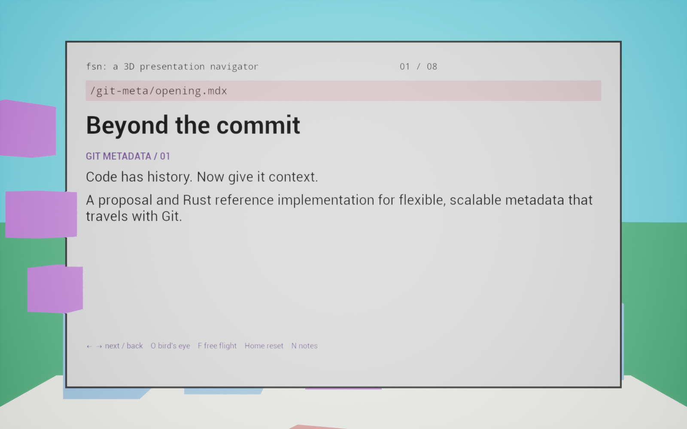
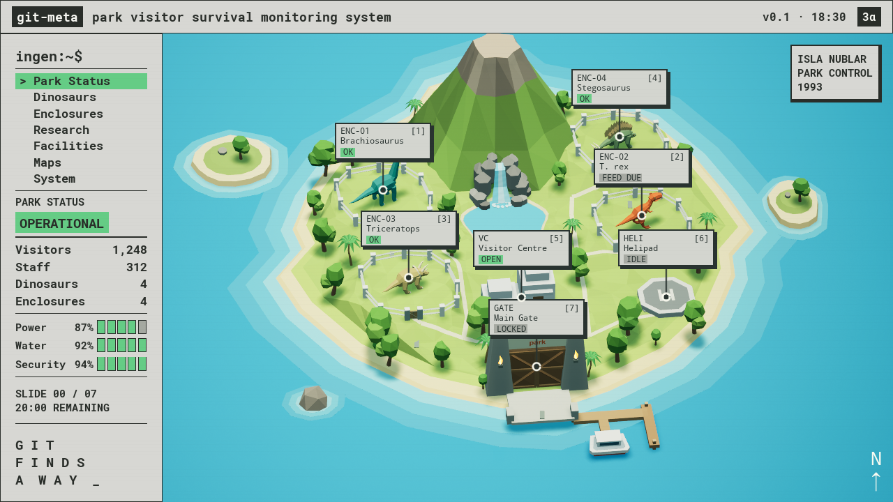

# Slide Engine

Write MDX. Build an Unreal game. Fly through your presentation over a shaded, low-poly Isla Nublar inspired by Jurassic Park’s UNIX interface.

A native Unreal Engine 5.8 slideshow engine with seven visible stations and a hidden eighth station. Each station plays an ordered sequence of MDX pages and native components. MDX is evaluated at build time; Unreal renders the resulting text and actors without a browser or JavaScript runtime.

## Run

Requires Node.js 22+, Unreal Engine **5.8**, and its supported C++ toolchain. On this Mac the default engine path is `/Users/Shared/Epic Games/UE_5.8`. Elsewhere set `UE_ROOT` to your engine installation.

```sh
npm install
npm run build             # MDX → unreal/Content/Slides/deck.json
npm test
npm run unreal:build      # Compile the native editor module
npm run unreal:prepare    # Create the entry map and materials (first run only)
npm run unreal:import-assets # Import the checked-in Blender FBX kit
npm run unreal:play       # Recompile current slides/casts, then launch with the editor
```

To produce a standalone game:

```sh
npm run build
npm run unreal:package    # Build, cook and archive into dist/
```

Run `unreal:build` and `unreal:prepare` before the first package. The prepare step also creates the native material used by the retro landscape. Packaging targets the host platform. The packaged application loads the embedded deck and opens on the workstation login. No sibling repository, Node installation or editor is needed to run the packaged game.

For quick content updates after packaging, quit the running presentation and run:

```sh
npm start
```

This recompiles `slides/` and local `casts/*.cast`, then launches the packaged
native app with that fresh manifest. On macOS it stages the manifest inside the
app sandbox, where the packaged process can read it. The build prints each cast
filename and recording title. No Unreal rebuild or packaging is needed
for MDX/cast changes. A running presentation holds its loaded deck in memory;
restart it to use new content. Opening the `.app` directly uses its last packaged
deck instead. `npm run unreal:package` also recompiles content automatically so
standalone exports include the latest recordings.

## Park workstation

After login, the island overview shows seven numbered map cards.
Press **1–7** (including the numeric keypad), click a card, or click its numbered sidebar location to zoom into its
location. After arriving, a blank card expands, shows a brief Unix-style
loading prompt, then reveals the full MDX slide. **Esc** returns to the overview.
**Left/Right** advance through the files at the current station. At either end, they
return to the overview and stay there. Press again to fly to the previous/next
station, wrapping around the seven visible cards. Each visit starts at the first
page. The initial forward press opens station one.
Selecting a number, map card, or sidebar location flies directly to that destination via the overview.
The next unvisited map station blinks red, future stations are blue, and visited
stations turn green or gray. Status jokes follow each location, from “LEAF ME
ALONE” to “FEED THE LAWYER” and “HOLD YOUR BUTTS.” Logout resets the sequence.
Other cards disappear immediately during a zoom and pop back in during the final
12% of the return to overview.
Each area has a fixed, elevated camera angle and its own 0.8-second swooping
flight, ending in front of an angled physical sign. A narrow-field perspective overview transitions
continuously into the close view without switching projection modes. Content stays hidden during
travel and retraction. The arrival pause is 0.12 seconds, card expansion takes
0.24 seconds, and the loading prompt lasts 0.32 seconds.

The top-aligned sidebar links to all seven slide locations and shows park status,
the dinosaur population, visitor and staff countdowns, and the slide number.
**Power** shows the percentage of MDX pages still unviewed, counting every station,
subpage, interactive step, and the hidden bonus. Each page drains it once; going
back or revisiting does not consume more. **Security** shows the percentage of
session time remaining and follows the timer's start and pause controls. Both
use ten solid green boxes, empty to gray, and reset to 100% on logout.
Park status changes below 50% Security to yellow **Nominal**, below 10% to orange
**Critical**, and below 5% to red **UTTER CHAOS**.
Use **git-meta → Time…** to enter elapsed minutes for testing. Decimals are
accepted from zero through the session length. Apply updates counters and status
immediately, preserves pause, and starts the clock if it has not started yet. The footer reads
“GIT FINDS A WAY.” The app starts at an SGI-style desktop with the Git-meta Park logo, a live clock,
a black IRIX console, Toolchest menus, and a central workstation login.
The `xclock` face has minute ticks and quarter-hour numerals; `[-]` at the far right collapses or
restores each auxiliary window. The login window remains open. The larger console
uses bigger text and fits the available space beside the login panel. Toolchest can restore the windows or focus the workstation field. **Enter** or
**Login** types `s.chacon` and a masked password, then opens the overview.
The editable **Workstation** number sets the session length in minutes (6–180,
default 35). Visitors start at `(minutes − 5) × 100` and staff at `minutes × 10`,
preserving five minutes to wrap up. The timer starts when
the first slide content becomes visible, after arrival and loading. **P** pauses it.
The clock keeps running on the overview. At workstation 35, visitors start at 3,000 and leave in random
batches of 1–50, totaling exactly 100 each minute. They reach zero at 30 minutes,
leaving five minutes to wrap up. Staff start at 350 and leave in batches of 1–10,
totaling exactly 10 each minute and reaching zero at 35 minutes. Both counters
pause with the timer, stay at zero, and flash red when empty. The top-right badge reads `s.chacon`. The visible population counters replace the
remaining-time readout; the configured clock continues internally.

The scene uses faceted trees, a volcano, lagoon and waterfall, white paddock
fences, entrance gate, visitor buildings, helipad and dock. A large cartoon dung pile sits beside the triceratops. Three paddocks each have one cartoon dinosaur; the compact raptor pen has three. The overview uses a distant, narrow-field perspective camera to match the
supplied island-diorama mockup. All six dinosaur models wander within their
enclosures along varied, smooth loops, walking for 12–19 seconds and resting for
7–11 seconds on staggered schedules. Walking is six times the original speed,
with gentle acceleration and deceleration. Their hips, knees, and ankles articulate with planted support feet and lifted
recovery steps that finish before a rest. Stride timing follows actual movement, including turns, and the
three raptors keep separate lanes. The interface adds a workstation frame and subtle scanlines. The scene has its
own viewport beside the compact sidebar and below the title bar, and preserves
the full slide sign across window sizes. Click **git-meta → Logout** to return to login, retaining the workstation number
and resetting the clock, counters, camera, gate and computer demo. The next login
starts a fresh session; the timer again waits for the first slide.
Click **git-meta → Exit** to exit.

## Controls

| Key | Action |
| --- | --- |
| Enter on login | Type credentials and open park control |
| 1–7 / numeric keypad | Open the corresponding map card |
| 8 / numeric keypad 8 | Visit the hidden north-beach bar and bonus slide |
| Click a map card or sidebar location | Open that area's slide |
| Right / Space / Page Down | Next MDX page; at the end, overview, then next station |
| Left / Page Up | Previous MDX page; at the beginning, overview, then previous station |
| Esc / O | Return to the overview; cancel any queued destination |
| Home | Open slide one |
| P | Pause or resume the countdown |
| F | Toggle free flight; leaving returns to overview |
| Drag in free flight | Look around |
| WASD / Q / E in free flight | Move forward/left/back/right / down / up |
| Arrow keys in free flight | Move forward/back and left/right, like WASD |
| Shift in free flight | Move faster |

Free flight hides all slide signs and map labels. Number keys and sidebar locations fly directly to the subject, without opening a slide or starting the presentation clock. Moving or dragging interrupts a destination flight. The sidebar stays available, and Escape also exits to overview.

The north beach extends behind the volcano, with a thatched bar, two seated
visitors, umbrellas, stools, bottles and palms. Its eighth stop is hidden from
the map and sidebar; the forward route reaches it after station 07, or press **8** to visit directly. The
example bonus slide rises behind the bar. In free flight, **8** visits the scene
without revealing the slide.

In the first area, **Right** advances from the opening page to the MDX-authored
computer demo. Its camera-facing 3D workstation rises, types the `<prompt>`, then
prints `<output>`. The earlier page stays beside the computer; further pages
and demos join the same group layout. **Left** revisits a page without removing
revealed content; **Right** continues or returns to overview at the group end.
Leaving the group hides all its content. Re-entering the group starts it fresh. These are demonstration graphics; no shell command is executed.

At the main gate (**4**), the doors swing inward to reveal a stationary slide
behind the gateway. Leaving the area closes them again, including interrupted
visits and switching to free flight.

## Author slides

The active presentation lives in `slides/01/` through `slides/08/`. These folders
map to the eight cards in `examples/git-meta/layout.json`, in card order. Add one
`.mdx` file per step; filenames sort numerically (`01-intro`, `02-example`, `10-end`).
Run `npm run build`, then restart the game, or package again for a standalone app.
An empty or missing station is a build error.

Ordinary Markdown becomes a page on the existing physical sign. The first
heading supplies the page title. A page containing only a single H1 becomes a
physical wooden direction sign with large painted lettering, an arrow-shaped end,
and supporting posts. At the helipad, it becomes a blue aviation placard with a helicopter pictogram and a level, front-facing camera. The sign stays behind ColdStorage demonstrations. Arrows replace the current page with a short
forward or backward swipe, using the full sign without moving the camera. Dense
text scales down to fit; pages are not automatically split. The header updates
the station name and page number on each step.

A single native component occupies its own step. Computer models rise large in
front of the slide window, with the latest Markdown slide retained behind them. Components
are available without imports. For example, `slides/04/02-example.mdx`:

```mdx
<Computer>
  <prompt>git meta set</prompt>
  <output>OK</output>
</Computer>
```

`Computer` requires one prompt and one output; both come from the file. `Model`
and `Animate` also work as standalone scene steps, or alongside Markdown on a
sign page. `CommandLine` replays a local asciicast file in the workstation terminal:

```mdx
<CommandLine cast="casts/7821.cast" />
```

Keep recordings in the project-root `./casts/` directory. The `cast` attribute
accepts `casts/name.cast`, `./casts/name.cast`, or `name.cast`; `src` is an alias.
Recordings are compiled into the deck for offline native playback. ANSI colors,
cursor movement, screen clearing, alternate screens, and terminal resizing are
interpreted with xterm. Both [asciicast v2](https://docs.asciinema.org/manual/asciicast/v2/)
and [v3](https://docs.asciinema.org/manual/asciicast/v3/) timing are supported.
Optional `speed={2}` and `idleTimeLimit={2}` accelerate playback or cap long pauses.
The terminal provides Play/Pause, Replay, and a seek bar. **Space** pauses/resumes
playback, or restarts a finished recording; arrows still navigate slides. Returning to a recording
within the same station resumes it. Leaving the station resets its recordings.
`CommandLine` no longer takes prompt/output children; `Computer` still does. Park control shrinks into a dock
thumbnail while the terminal replaces the login window; the clock, toolchest,
and console remain. Arrows navigate as usual, and clicking the dock restores the
preceding presentation step. The map maximizes again without resetting the timer.
Imported reusable components must expand to these native primitives. Speaker notes and the N shortcut are removed.
Unknown components and unsupported combinations fail with the source filename.
To add a new interactive primitive, extend the registry/serializer in
`src/compiler.mjs` and its native lifecycle in `ParkStationContent.cpp`.

`FSV` uses the same minimize-to-desktop transition to open an SGI-style filesystem
viewer. Its window title and ordered systems come directly from the MDX:

```mdx
<FSV title="New Metadata Use Cases">
  <system>
    <label>trust</label>
    <meta>identity, signoffs, attestations</meta>
  </system>
  <system>
    <label>provenance</label>
    <meta>generated code, prompts, transcripts</meta>
  </system>
</FSV>
```

The initial view shows all systems as labeled blue blocks. Right selects each
system in order: its block rises into a tower, a pale spotlight surrounds it,
and its metadata appears alongside. Left reverses the sequence. Click a block
to select it directly, or `/systems` for the flat overview. After the last
system, Right advances the presentation; Left before the first selection goes
to the preceding slide. The dock and minimize button restore the prior slide
immediately. Each system counts toward Power progress. A full example lives in
`examples/git-meta/fsv.mdx`.

The legacy single-file example remains in `examples/git-meta/deck.mdx` and can
still be compiled explicitly. Blank lines around Markdown inside components are
significant MDX syntax.

```mdx
import {Deck, Slide, Model, Animate} from '../../src/components.jsx'

<Deck title="My talk">

<Slide id="hello" title="A world of ideas" accent="#563d72">

## CHAPTER ONE

Markdown paragraphs, **emphasis**, lists and fenced code.

<Animate kind="spin" speed={25}>
  <Model mesh="/Engine/BasicShapes/Cube.Cube" position={[0, 760, 0]} scale={[2, 2, 2]} />
</Animate>

</Slide>

</Deck>
```

Build another deck with `npm run build -- path/to/deck.mdx path/to/layout.json`; omit the layout argument to use automatic placement. The output replaces the active deck.

MDX uses the official compiler and supports JavaScript expressions, imports and reusable JSX function components. See `examples/git-meta/components.jsx` for composition examples. Imported components must ultimately produce the supported scene primitives or Markdown elements. Authoring code runs with Node permissions: compile decks you trust.

Supported Markdown: headings, paragraphs, lists, blockquotes and fenced code. Inline emphasis and links currently render as plain text; links are not interactive. HTML widgets, React hooks, browser APIs and tables are not supported. Standalone `<Image src="./chart.png" alt="Chart description" />` pages display a local PNG on the presentation board. Image paths resolve relative to the MDX file; the original image is embedded in the manifest and fitted to the full board without cropping. Unsupported block elements fail the build. This is a native scene component contract rather than a React DOM renderer.

## Models and animation

`Model` accepts `mesh` (Unreal object path), `position`, `rotation` and `scale`. Import custom meshes into `unreal/Content/Models` using the Unreal editor and copy their object paths:

```mdx
<Model mesh="/Game/Models/Robot.Robot" position={[0,760,0]} scale={[1,1,1]} />
```

For custom behavior, create an Actor Blueprint in the same folder. Its construction script, components, tick logic and timelines run natively:

```mdx
<Model actor="/Game/Models/BP_Robot.BP_Robot_C" />
```

The `Models` directory is always cooked so assets referenced only by JSON survive packaging. If you use another folder, add it to `DirectoriesToAlwaysCook` in `unreal/Config/DefaultGame.ini`. An unresolved asset produces an Unreal error log.

`Animate` wraps one or more models. `spin` rotates around yaw at `speed` degrees per second. `bob` moves on world Z by `amplitude` centimeters, with `speed` in radians per second. Motion runs continuously across the whole presentation. Nested animation wrappers are rejected; use Blueprint timelines for combined or event-driven motion.

## Island layout and flight route

The Git Meta example now uses a rough Isla Nublar map: ocean, sandy coastline,
mountain ridge, forest and four fenced dinosaur habitats. The geography is a
creative approximation, not a canonical reconstruction of a film map.

Edit `examples/git-meta/layout.json`:

- `scene: "isla-nublar"` selects the island environment.
- `habitats` defines the four dinosaur areas and their terrain elevations.
- `cards` maps each slide ID to a unique map code, label, status, and world position.
  Every slide must have exactly one card when this list is supplied.
- Each card’s `view` stores its fixed `eye`, subject `look`, ground `anchor`, `signYaw`,
  `signHeight`, and two world-space Bézier control points in `path`. The seven
  authored approaches curve in from different sides with a subtle camera bank.
  Coordinates and heights are in centimeters; yaw is in degrees. The dinosaur
  views follow each fence gateway; facility views face the visitor entrance,
  main gate, or helipad from its approach path.
- `transition: 0.8` sets the zoom-in duration; returning takes 75% of that time,
  followed by a brief overview pause before the next zoom.
- The seed still controls a deterministic habitat route for layouts without cards.

| Key | Area | Content directory |
| --- | --- | --- |
| 1 | Research Center | `slides/01/` |
| 2 | Helipad | `slides/02/` |
| 3 | Velociraptor pen | `slides/03/` |
| 4 | Main Gate | `slides/04/` |
| 5 | Triceratops | `slides/05/` |
| 6 | T. rex | `slides/06/` |
| 7 | Brontosaurus | `slides/07/` |
| 8 | Hidden beach bar | `slides/08/` |

North is world +Y. The overview uses a distant perspective camera; each authored stop faces a physical
sign rising from a marked plinth.

Dinosaur models, landscape, buildings and foliage are original Blender meshes,
imported as native Unreal static meshes with authored vertex colors.
Terrain and models receive sunlight, dynamic shadows and ambient occlusion;
the slide text stays readable in the original workstation-style windows.
The Blender scene contains an authored forest with varied broadleaf trees and palms.

## Blender art assets

The editable source is [assets/blender/park.blend](assets/blender/park.blend).
It contains independent collections for eight dinosaur sculptures, architecture,
fences, foliage, terrain, and water. The scene currently places six dinosaurs in four enclosures,
two offshore islands, a boulder with shallow water, and the git-meta park entrance.
The other four dinosaur models remain available in the asset library.

See [the asset workflow](assets/README.md) for rebuilding with Blender MCP and
importing into Unreal. The park uses FBX geometry, not a background image.
Paths are a single non-overlapping mesh fitted to the terrain triangles.
The four paddocks have level ground at different heights, connected by slopes.

## Generic layout

Without overrides, slides follow a rising arc: radius 4,200 cm, angular step 0.48 radians, elevation step 380 cm. Each panel faces its own camera stop. Smoothstep movement and quaternion rotation blend between stops; a new navigation command starts from the camera's current transform.

For decks without the island scene, a layout can contain partial overrides:

```json
{
  "version": 1,
  "transition": 2.2,
  "slides": {
    "hello": {
      "position": [0, 0, 0],
      "yaw": 0,
      "cameraDistance": 1550,
      "transition": 3
    }
  }
}
```

Positions use Unreal centimeters: X forward, Y right, Z up. Panel-local +X faces the camera, +Y places models beside the panel. Rotation arrays are `[pitch, yaw, roll]` in degrees. Layout keys are stable slide IDs; overrides never change deck order. Unknown IDs, duplicate IDs, invalid vectors and nonpositive timing or camera distances fail compilation.

Panels are 1,440 × 900 units. Keep content concise; the first version does not paginate overflow automatically. Generic camera paths interpolate directly between stops. Island paths use two authored Bézier control points for their swoop; free flight and arbitrary custom layouts do not perform collision avoidance. Free flight makes the full spatial layout available to explore.

## Project structure

- `src/`: MDX scene components and compiler/validation.
- `slides/01`–`slides/08`: active station pages and interactive steps.
- `examples/git-meta/`: station camera layout and legacy single-file example.
- `unreal/Source/SlideEngine/`: native panels, actors, animations and camera controls.
- `unreal/Content/Slides/deck.json`: compiled presentation, staged into the game.
- `scripts/`: MDX build, Unreal build, map creation and packaging.
- `test/`: compiler and layout behavior tests.

The sample describes the README's proposal, including its reported benchmarks. The git-meta project identifies `spec/README.md` as canonical for current semantics.

Implementation references: [MDX compiler](https://mdxjs.com/packages/mdx/) and [Unreal world-space widget components](https://dev.epicgames.com/documentation/unreal-engine/API/Runtime/UMG/UWidgetComponent).

## Native integration check

After building and preparing, run `node scripts/unreal.mjs smoke`. This explicit
test mode visits every slide, checks the final camera position, writes screenshots
to `unreal/Saved/Screenshots/slide-01.png` through `slide-08.png`, and exits.
Normal play and packaged games never auto-advance. The test also captures `park-overview.png`.
Run `node scripts/check-stations.mjs` for forward/backward swipes, authored computer
playback, component cleanup, and station-boundary navigation using a temporary
fixture. `node scripts/unreal.mjs smoke -TerminalTest` exercises the authored
first-station computer; `-LoginTest` verifies session reset and logout.

Packaging includes Unreal's platform bundling step so the Mac app contains its
cooked content and native libraries. macOS is the platform exercised here; other host platforms still
need their own build and runtime verification.

## Preview





See [verification notes](docs/verification.md) for tested behavior and limits.

## Cryogenic storage and raptor records

`<ColdStorage>` displays a modeled vacuum flask with four separately animated
vials. Supply exactly four `<canister>` children, each containing a `<Species>`
and `<Description>`. See [cold-storage.mdx](examples/git-meta/cold-storage.mdx).
Right returns the previous vial, rotates the rack, then extracts the next vial,
enlarges and tilts it sideways for reading, and reveals its description. Left reverses the sequence. After the fourth vial,
Right advances to the next MDX page or returns to the island overview.

Station 03 is the Raptor Pen. Its warning page can be authored as:

```mdx
<RaptorWarning>Problems with existing solutions</RaptorWarning>
```

This replaces the screen with a gently swinging wooden sign with claw marks.
The following `<Raptors>` page flies over the enclosure and labels the four
walking animals. Each Right press selects another raptor and flips the keeper's
clipboard to that animal's incident record. Left steps backward. The current
animal has a moving ground highlight; the clipboard includes crossed-out worker
figures as a fictional casualty tally.

```mdx
<Raptors>
  <Raptor workers={2}>
    <Label>git notes</Label>
    <Problems>
      <Problem>Awkward merge behavior for structured data</Problem>
      <Problem>Poor scaling for very large metadata sets</Problem>
    </Problems>
  </Raptor>
  {/* Add three more Raptor records. */}
</Raptors>
```

Supply exactly four records. `workers` is optional (0–8); defaults are 2, 4, 3,
and 6 in authored order. The complete example is
[raptors.mdx](examples/git-meta/raptors.mdx). Vial and raptor selections count
as individual steps in Power, and logout resets their progress.

The cryogenic source model is `assets/blender/cold-storage.blend`. Recreate it
with Blender's Python runner using `scripts/model_cold_storage.py`, then run
`scripts/import_cold_storage.py` through Unreal's `-ExecutePythonScript` option.
`scripts/import_prop_materials.py` rebuilds the unlit lettering materials.
The wooden signs and clipboard are native procedural assemblies, so their text
and proportions follow the MDX without exporting another Blender model.

Run `node scripts/check-native-props.mjs` for the isolated native interaction
fixture; it does not change the authored slides.

Forward navigation continues from station 07 through the hidden beach bar at station 08. At the end, **Logout?** offers Yes (or Enter/Y) to minimize park control into a desktop Questions terminal, or No (or Escape/N) to stay. The presentation timer pauses during questions. The dock restores the final station; Escape returns to login and resets the session.

ColdStorage canisters optionally accept `<Label>` for the description heading; `<Species>` remains the name printed on the vial.

Station 01 opens at the Research Center with a physical employee badge using the first MDX page’s title and body. ColdStorage rises in front of the badge on the next step, dimming the scene behind the hardware and description until the demonstration closes. Station 04 presents the git-meta introduction at the Main Gate; station 06 presents exchange at the T. rex paddock.


`<Serializer>` minimizes the park into a desktop with a SQLite browser, Git object explorer, commit sidebar, and pointer-following xeyes:

```mdx
<Serializer title="Git Object Explorer">
  <Value target="commit:5aa110f" key="review:status" type="string" value="approved, later merged" />
  <Value target="project" key="reviewers" type="set" value="alice, bob" />
  <Value target="path:main.rs" key="ci:runs" type="list" value="build:passed, test:passed" hidden />
</Serializer>
```

Click **SERIALIZE** to write the first metadata commit, containing only values without `hidden`. **Add metadata** reveals the hidden rows in the SQLite table; serialize again to write a second commit containing both the original and added values. Click either commit to show its table and tree. Newly added values have green backgrounds in the second commit. Click a table value to locate its blob and fold unrelated branches. **Expand** and **Fold** beside Help open or close every path. Click a folder's +/- control to expand or collapse it, or a tree entry to inspect its SHA/type, full path, value, target, and key. Scroll over the table or tree to browse it. Long values scroll inside the separate value pane. Blue target fields and green key fields match their corresponding path segments.

The tree root is `refs/meta/local/main^{tree}`. The compiler produces real Git blob, tree, and parent-linked commit SHA-1 IDs, `__value`, `__set`, timestamped `__list` entries, branch hash prefixes, and escaped `path/.../__target__` directories. Keys beginning with `local:` stay out of the exchange tree. Strings preserve their raw text; the demonstration's set/list `value` accepts comma-separated members. Sets deduplicate members; lists preserve their order.

The example snapshot in `examples/git-meta/serializer-reference.json` records reference data from `/tmp/meta-demo`; it resolves the example's short target commit IDs and preserves list timestamps while keeping the packaged demo independent of that repository. The commit sidebar shows the demonstration's metadata snapshots. The interactive demonstration stays in memory and does not modify the source repository or SQLite database.

Arrow keys continue the presentation. Returning to the component preserves its current tree; leaving the station or logging out clears it. Run `node scripts/check-serializer.mjs --packaged` to exercise the native desktop interactions after packaging.

`<Scalar />` opens **gitviz**, an SGI-style desktop visualizer at station 07.
It steps through two writes, a prune commit, a fourth commit adding E, a full push, User 2's metadata-only clone, a tip hydrate,
a missing-object lookup, an on-demand fetch, and User 3's depth-1 clone and unavailable-history lookup. Purple commits point to teal trees; gold cubes are local
blobs. Dashed boxes on User 2 indicate promised objects. The prune preserves
historical trees and blobs; clone gets no blobs, hydrate gets C/D/E, and reading k1 fetches only A. User 3 receives only C4/T4/C/D/E; k1 is outside its shallow history and cannot trigger a blob fetch.

Commands appear in large type and type out over one second each time a stage starts.
Use Space/Right and Left to move through the eleven steps, or click the step list.
R resets, B steps back, and P toggles playback. Tilt, Zoom, and Speed sliders
control the view and playback; **bird's eye** and **front view** are presets.
At either end, arrows continue to the adjacent presentation page. **Session**
or the title-bar minimize button restores park control. Returning to the page
preserves state; leaving the station or logging out clears it. Each visited
Scalar step counts toward Power progress.

An optional `title` prop changes the window title. The demo is an in-memory
presentation: displayed `git meta` commands follow `../git-meta`'s CLI, but do
not execute against a repository. A–E, C1–C4 and T1–T4 are readable aliases;
nested Git path trees and metadata bookkeeping are omitted. All five keys use
`path:demo`. The demo dates k1/k2 to August 31, 2026 and k3/k4 to September 11,
so `prune --since 2026-09-01` retains exactly C/D. The displayed commands omit
timestamp arguments.
User 2 setup has no depth limit; User 3 uses `.git-meta` with `depth: 1`.

Run `node scripts/check-scalar.mjs` for the native interaction test, or add
`--packaged` after packaging. It captures add, prune, clone, hydrate, and read screenshots
in `unreal/Saved/Screenshots/`.

Scalar renders real native meshes into its desktop viewport. Commit, tree, and
blob labels are inset onto their top planes, with consistent, top-aligned commit/tree text and equal tree dimensions. Commit
labels omit authors and timestamps. Drag
the viewport to orbit, swipe with two fingers on a Mac trackpad to pan, and
pinch two fingers, use the mouse wheel, or use the Zoom slider to zoom. Panning follows the current camera
orientation, with inverted vertical swipe motion. Reset or switch camera
modes to recenter. **Camera: moving camera** follows
each step's action; click it (or press C) for **full scene**, which keeps all
four spaces framed. Mouse orbit and trackpad panning work in both modes.
Hold Shift and drag to draw freehand highlights over the scene. Each new
stroke uses the next color; outlines can overlap and fade independently over
two seconds after release. Repeated clicks also work while Shift stays held.
Normal dragging still orbits.

Commit steps create their commit first, then the tree, then each new blob, with
short growth animations and pointers appearing after their objects. Existing
objects stay visible; prune creates only C3 and T3. Autoplay waits for creation
to finish before advancing.

Push animates thirteen object copies to the remote (four commits, four trees,
five blobs). Setup first animates eight metadata copies to User 2 (four commits, four trees),
then a separate hydrate step animates C, D and E. These are two phases of the same
`git meta setup` command. The get step first shows the missing A lookup; the following step
animates A's promisor fetch and returns its value. Source objects stay in place,
and B stays remote. Autoplay lets each transfer finish before advancing.


`<Exchange />` stages “Two keepers, one dinosaur” in the park: Keeper 1 on the
left, the append-only **CRDT-Rex** record in the middle, and Keeper 2 on the right.
The care cards use `dino:name` (string), `feeding:foods` (set), and
`feeding:times` (list). Keeper 1 creates B with Rex, two foods, and one feeding
time. Keeper 2 copies it; both keepers independently edit their own copies.
Keeper 2 publishes R first. Keeper 1’s push is blocked, then merges locally:
Chomper wins over Tiny, all four foods survive, and both feeding times join the
ordered list. Retrying appends M after R. The center keeps all three complete
snapshots; neither a rejected push nor a local merge appends an entry.
Keeper 2 keeps their existing copy until they synchronize again.

The keepers enter the scene, values travel between their clipboards and the
record, and a refused push returns to its sender. Gold labels identify local
name selection and clean collection merges. Space/Right advances, Left goes
back, and R restarts. The park background stays dim while the story is visible.
The example uses shared ancestry and additions/appends; deletions, tombstones,
and unrelated histories are outside its scope. Publishing stages illustrate the
automatic fetch/merge/retry inside `git meta push`, not a `--ff-only` CLI flag.
Run `node scripts/check-exchange.mjs` (or `--packaged`) for native checks and
screenshots of the full keeper workflow.

`<SpeedGraph metric="total" />` follows Scalar with a physical pull-down
screen. The top housing stays fixed while the bottom roller and handle descend
over 1.6 seconds, revealing four vector brontosaurus silhouettes. Bodies stay
the same size; a common short neck plus a time-scaled extension provides an
illustrative comparison. The printed times carry the numeric comparison. Horizontal 100-second grid
lines share one scale, colored neck bands and ticks mark the timing phases,
and a dashed tick marks setup returning before background indexing finishes.
Each dinosaur has a numeric fetch/hydrate/repack/materialize/index breakdown.
Phase values retain the source graph rounding; widths normalize to its total.
`setup` subtracts background indexing from the supplied benchmark totals and
rounds labels to seconds (12 / 64 / 444 / 91). `metric="total"` instead shows
12.8 / 79.5 / 553 / 93 seconds including indexing. The original benchmark PNG
remains in `slides/07/images/` as the data reference.

`<Image src="./image.png" alt="..." />` is also supported for ordinary board
pages. Images are embedded in the manifest and scaled to fit the physical sign.
