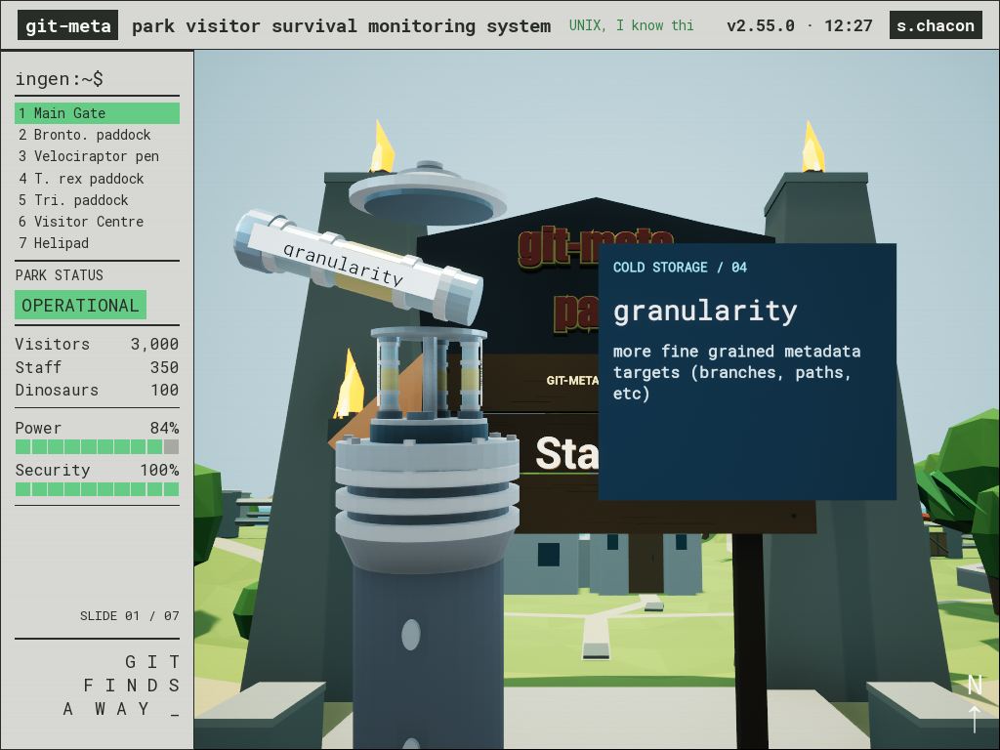
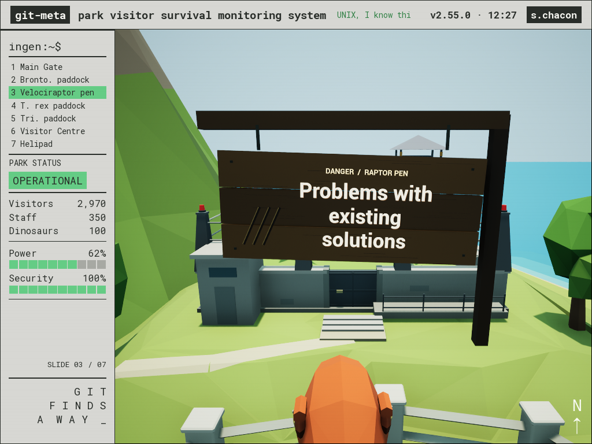
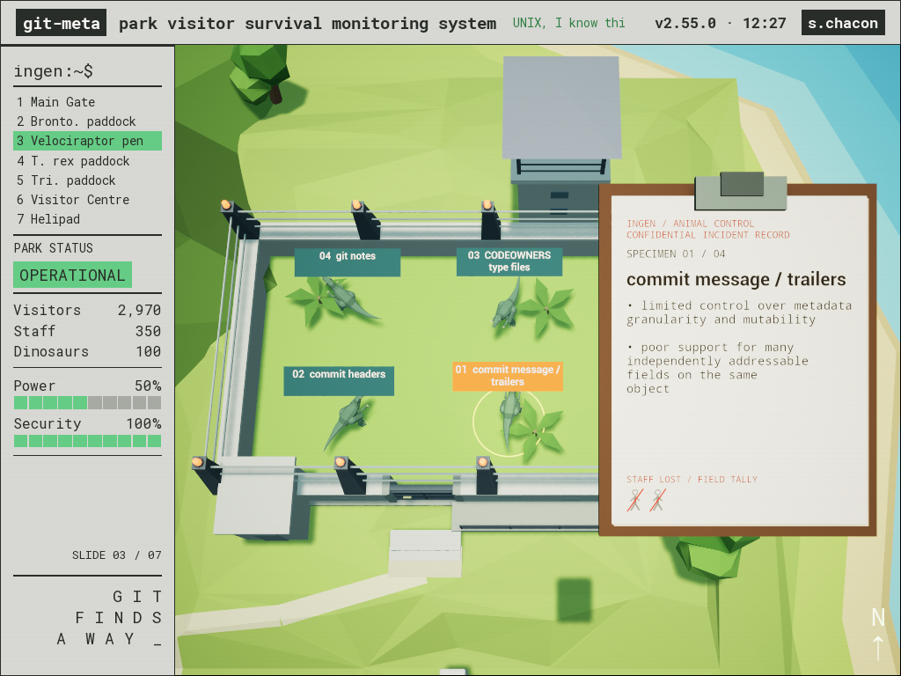

# Verification — September 8, 2026

Tested on macOS with Unreal Engine 5.8 and Xcode 26.5 SDK.

- Six MDX/compiler tests pass, including the seven-slide example, reusable JSX
  components, deterministic layouts, invalid-input rejection, and one-to-one card
  assignments for the four paddocks and three facilities.
- Native editor and game C++ targets compile successfully.
- `-SlideSmokeTest -FreeFlightTest` checks entering free flight from both the map
  and an expanded slide, all seven numbered destinations, hidden signs, manual
  movement interrupting travel, drag rotation, vertical/accelerated movement,
  and F/Escape returning to the fitted overview. Exploring before the first slide
  leaves the presentation clock stopped. The raptor arrival was visually reviewed.
- The park library now contains 29 imported meshes, including the beach bar and
  interactive workstation; articulated dinosaur parts remain a separate kit.
- BuildCookRun build, cook, stage, package and archive succeeded.
- Editor and packaged integration checks passed. The smoke test opens every
  numbered card, switches with number and
  arrow commands, interrupts a zoom, and cancels the queued destination with Escape.
  Forward/back each hold at overview until a second press; that pause is checked explicitly.
  It checks camera position, arrival before card expansion, an unobstructed flight,
  and continuous perspective projection throughout the transitions. Each arrival
  must match its authored camera position and look direction, with the physical
  sign fully raised.
- Screenshots cover the numbered overview, expanded slides, mid-zoom card hiding,
  all seven subject-facing arrivals (dinosaurs through their gateways, visitor
  door, main gate, and helipad), a content-free loading prompt, and cards reappearing near
  the end of the overview return.
- The hidden eighth stop is excluded from overview cards, sidebar locations and
  sequential navigation. Native checks exercise key 8 in presentation and free
  flight, confirm the bonus sign fits, and capture both views.
- `-SlideSmokeTest -TerminalTest` exercises the first area's Space toggle,
  incremental `git meta set` typing, delayed `OK`, retraction, replay, and hiding
  on navigation. It checks the screen fills most of the available viewport and that
  Space still navigates in other areas.

The terminal top bar includes a live local clock. Gate flames use masked
material flicker and movement; the waterfall uses flowing color bands and gentle
surface/foam movement. The weather section and DNA character are removed. The sidebar footer reads
“GIT FINDS A WAY”; the slide count remains visible, with population counts replacing the time readout.

Manual keyboard/mouse events were not automated: the smoke test invokes the same
key handler used by runtime input. Non-Mac builds have not been exercised.
Population counts and utility levels are illustrative. Visitors and staff follow
the presentation clock; the dinosaur readout is 21 and the enclosure row is removed.

The raptor pen has eight shared upper posts and blinking red lenses. Twenty-five
terrain samples beneath its full footprint and watchtower match the 9m terrace.
Waterfall splash lobes are separate meshes with staggered scale animation.

Viewport projection checks cover all seven signs at 800×1000 and 1920×800, plus the packaged app at 1440×900.
They project each sign corner into the actual scene rectangle to detect clipping
by the sidebar, title bar, or window edges. The camera frames the sign closely;
decorative MDX models remain part of the surrounding scene.

The sidebar is top-aligned and its seven numbered location buttons select the same
slides as the map cards. The overview frames the island 11% closer. A separate
Blender dung-pile mesh sits on the terrain inside the triceratops paddock.

The 35-minute countdown starts only when slide content is first revealed. The
integration check verifies pause behavior, batch limits (visitors 1–50, staff
1–10), strictly increasing departure times, exact minute totals, and endpoints
across 100 random seeds. Visitors reach zero at 30 minutes; staff at 35 minutes.
Both clamp at zero and flash red independently of the stopped presentation clock.
The presenter badge reads “s.chacon.”

The first three sidebar entries read “Bronto. paddock,” “T. rex paddock,” and
“Tri. paddock”; the first map card reads “Brontosaurus.” The top bar adds
“it's UNIX, I know this...” in larger green text centered between the title and clock.

Dinosaur motion checks sample the entire 35-minute presentation: all six mesh
footprints remain inside their enclosure boundaries, raptors remain separated,
and faster walking remains continuous without position jumps. Each dinosaur has
12–19-second walking periods and 7–11-second stationary rests; checks verify the
body holds its position and heading and every foot settles during a rest.
The active dinosaurs now use 40 Blender-authored body and joint-centered limb
pieces. All six actors pass articulated gait checks at the beginning, middle, and
end of the presentation: every leg takes multiple steps, planted-foot slip is
below 0.01cm, bone-length and ground-contact errors are below 0.1cm, and recovering
feet visibly lift clear of the ground. Two-legged and four-legged gaits use
separate step sequences. The walking material deformation has been removed.

A native close-view capture is available in [triceratops-walk.mp4](screenshots/triceratops-walk.mp4).

The screen-focused framing and curled sticky note were visually checked at 1440×900
and 1024×768. The terminal interaction passes at both sizes, including incremental
typing, `OK`, unchanged camera position, retraction, replay, and navigation cleanup.
See [the computer demo](screenshots/terminal-ok.png),
[the hidden beach slide](screenshots/beach-bar-slide.png), and
[the beach in free flight](screenshots/beach-bar-free-flight.png).

The rear beach uses shoreline-normal offsets instead of radial scaling at its
concave neck. All 3,360 sampled contour points lie inside the next outer band,
and the sand toe extends below the water surface. The rebuilt island and water
passed native navigation, terrain/gait, and hidden-beach checks. See the
[north-shore model review](../assets/blender/north-shore-review.png).

`-SlideSmokeTest -GateTest` checks the two fixed hinge positions, mirrored door
rotations, stationary sign behind the portal, unobstructed sight lines, and
closing on Escape, interrupted number navigation, and free flight.
The gate interaction passes at 1440×900, and the full presentation check passes
at 1024×768. Captures show the [opening doors](screenshots/gate-opening.png)
and [slide through the open gateway](screenshots/gate-open.png).

The north-facing beach bar has broad warm and cool fill lights that lift faces
and the shaded counter without changing the island sun. Presentation and free-flight
captures were visually checked at 1440×900; the native navigation check passes.

Nedry's shirt, belly, limbs and facial details were broadened together in Blender,
keeping the flower pattern attached to his clothing. The beach-bar sign is 50%
larger and raised clear of the roof, with the camera aimed higher to contain it.
The rebuilt mesh and revised sign were visually checked in presentation and free
flight at 1440×900; the complete native navigation check passes.

`-SlideSmokeTest -LoginTest` exercises startup input blocking, invalid workstation
numbers, editing the session length, Enter routed through the focused Slate field,
incremental username/password typing, repeat Enter, the Login button and the actual
Logout menu button. It checks 45-minute and default 35-minute countdowns, the
five-minute wrap-up, waiting for the first visible slide, and resetting paused
sessions, the computer demo, free flight and an opening gate. These checks pass in
the packaged app at 1024×768 and 1440×900. The six compiler tests and full native
navigation check also pass. The final logo, tick-marked `xclock`, black IRIX console and Toolchest
were visually reviewed, along with the top-right auxiliary-window minimize controls and the larger,
search-free Logout menu. The full login interaction also passes with this desktop.
Login window refinement (2026-09-09): auxiliary minimize buttons sit at the far
right, the login panel has no minimize control, and the console is larger with
14-point text. Its size follows the available desktop space. Native login/logout
checks pass at 1440×900; the updated login screenshots were visually reviewed.

See the [starting desktop](screenshots/login-screen.png),
[credential animation](screenshots/login-typing.png), and
[Logout / Exit menu](screenshots/logout-menu.png).

The main-gate camera pulls back 22 metres, aims higher, and widens its frame to
show the raised park lettering above the doorway. `-GateTest` now verifies both
the slide sight lines through the opening and the lettering's viewport bounds.
The interaction and visual review pass at 1440×900.

## Station MDX sequences (2026-09-08)

The default build now compiles numbered `slides/01`–`slides/08` directories into
ordered station steps. Nine compiler tests pass, including numeric filename
ordering, first-heading extraction, native components without imports, custom
computer prompt/output, notes, scene models, and actionable authoring errors.
Legacy single-file deck tests remain passing.

Native `StationContentTest` uses a temporary four-page fixture without changing
source slides. It verifies both swipe directions, a fixed camera and physical
sign during swipes, repeat-key protection, authored computer playback, sign
restoration on returning to Markdown, an explicit overview pause at the station
boundary, and first-page reset on number selection. `TerminalTest` exercises the
actual first station, including incremental typing and replay. Full route smoke
passes all eight camera/viewport checks at 1440×900. `LoginTest` passes at
1024×768, including logout while the MDX computer is raised.

The Mac standalone package builds successfully. Use
`node scripts/check-stations.mjs -SlideTestWidth=1440 -SlideTestHeight=900`
to repeat the sequence test independently of the current authored content.
The packaged 1440×900 terminal test also passes: arrow entry, incremental typing,
backward retraction, replay, and cleanup on station departure.

## Power and Security meters (2026-09-09)

Both sidebar meters have ten solid green boxes with gray empty boxes and an
integer percentage. Power counts every compiled MDX page, including native
components and hidden stations; a page is counted once when its content opens.
Security uses the configured session duration and the existing paused timer.
Percentages round up so a meter does not read zero before it is exhausted.
Logout restores both to 100%.

Native `-ProgressTest` passes full/partial/empty state checks, subpage counting,
repeat visits, configurable duration, timer pause, and logout reset. The 1440×900
[partial progress view](screenshots/progress-partial.png) was visually reviewed.

## Retained group content and live park controls (2026-09-09)

Revealed Markdown pages, computer demos and CommandLine windows now remain in a
shared, fitted layout until the station is left. Going backward retains the
revealed set; re-entering a station clears it. Native sequence tests cover two,
three and four revealed steps, unchanged camera placement, computer playback,
backtracking and group cleanup. The authored three-step first station was
visually checked with all its content visible. Speaker notes, N-key handling,
and the slide-footer navigation hints are removed.

The next unvisited map group has a blinking red joke status. Visited groups are
green or gray; future groups are blue. Logout resets the sequence. The progress
integration check verifies these transitions and pulse colors.

Security changes the park banner below 50% to yellow Nominal, below 10% to
orange Critical, and below 5% to red UTTER CHAOS. The Time submenu accepts elapsed
minutes, including decimals, and updates the live counters and banner. Native
checks cover the exact boundaries, invalid input, pause preservation, and typing
34 minutes into the actual menu and clicking Apply. The Apply button and input
use the desktop's light/green styling.

The final Mac package builds successfully and passes the progress/status/Time
menu integration check at 1440×900. Nine JavaScript compiler tests pass.

## Foreground computer and workstation command desktop (2026-09-09)

`Computer` again fills the foreground in front of the physical slide, with the
keyboard and tower partially visible. `CommandLine` switches to the existing
workstation desktop, replacing the login form with a large terminal. A snapshot
of the complete map window shrinks into its dock thumbnail over 450 ms; returning
expands it again. Clicking the thumbnail restores the preceding step. Arrow
navigation, typed prompt/output, timer continuity, and actual logout remain distinct.

The native terminal sequence passes at 1440×900 and 1024×768. It verifies screen
coverage, incremental typing, completed output, dock animation, real Slate arrow
input, return to overview, revisiting completed demos, and logout reset. The
login regression suite and all nine compiler tests also pass. The final Mac
package builds successfully and passes the same terminal sequence at 1440×900.

Visually reviewed: [foreground computer](screenshots/terminal-ok.png),
[desktop terminal](screenshots/desktop-command-ok.png),
[minimizing the map](screenshots/desktop-minimizing.png), and
[restoring it](screenshots/desktop-maximizing.png).

## One Markdown page per sign (2026-09-09)

Station arrows now replace the current Markdown page with a full-width page and
an updated station/page header. Forward and backward changes use a 280 ms swipe;
the sign and camera stay fixed. Native components keep the latest Markdown page
behind them. The four-step integration fixture passes replacement, backward
navigation, native computer playback, group boundaries, and station reset.
The settled [replacement slide](screenshots/station-replaced.png) was visually checked.

The computer now displays a `$ ` prompt, with its default command font reduced
from 82 to 64 and output font from 96 to 72. The READY/header text is also slightly
smaller. The native computer fixture verifies authored typing/output and the
updated presentation was visually reviewed.

## Local asciicast playback and gate screen flight (2026-09-09)

CommandLine compiles local asciicast v2/v3 recordings with xterm's terminal
interpreter into timed row patches. Native Slate draws the resulting colored
cells, backgrounds, text styles, and cursor. Playback supports pause, replay,
seeking, resize events, and repeat visits while preserving the existing dock
minimize/restore transition. No terminal commands are executed.

All 15 compiler tests pass, covering both timestamp formats, ANSI palettes and
truecolor, cursor operations, alternate screens, split escape sequences, resize,
local path validation, and MDX integration. The deterministic terminal integration
fixture passes the full Computer → desktop recording → map → logout sequence.
The packaged app passes playback, Pause/Replay button clicks, forward/backward
seeking, and timer-preserving map restoration with the supplied Vim recording.
[ANSI terminal playback](screenshots/cast-vim.png) was visually reviewed.

The gate sign now waits behind the fully opening doors, flies through to its
reading position, and returns before the doors close. Native checks pass arrival,
clearance, fixed camera, interrupted navigation, Escape, and free-flight cleanup.
[Gate reading view](screenshots/gate-open.png) was visually reviewed.

`npm start` recompiles authored slides and casts and supplies an external manifest
to the packaged app. This avoids a new Unreal package for content-only updates;
directly opening the app retains the portable, embedded-deck behavior.

The macOS refresh regression was reproduced and fixed: external project files
are unreadable inside the packaged app sandbox. The launcher now stages the
fresh manifest in the bundle's data container and the app reads explicit
manifests through the physical filesystem. `npm start -- -SlideSmokeTest
-CastTest -SlideTestWidth=1440 -SlideTestHeight=900 -stdout` passes all recording
checks with the newly linked `casts/7821.cast`. The runtime log explicitly reports
that filename, and its title, ANSI colors, 80×24 dimensions, and 34-second duration
were visually checked in [the updated recording](screenshots/cast-7821.png).

CommandLine keyboard playback also passes through real Slate key events in the
packaged app: Space pauses, resumes at the same position, ignores held-key
repeats, and restarts a completed cast without advancing the station page.

## Gate-first stations, title cards, and FSV (2026-09-10)

Station 01 now targets the main gate; the previous areas follow in order and the
hidden bar remains station 08. Funny map statuses follow their matching areas.
The existing gate interaction suite passes opening, sign flight, departure,
interrupted number navigation, and free-flight cleanup after the reorder.

A lone H1 becomes a large, centered title without the normal station header.
The compiler preserves normal heading/body layouts for other pages and validates
FSV titles and ordered system label/meta pairs. All 16 compiler tests pass.

FSV minimizes park control into the dock, opens an SGI-style desktop window,
and renders labeled blue blocks on rose platforms with cyan connections. Right
raises each system into a tower; a pale spotlight pool and faint overhead beam
highlight the selection, with its authored metadata connected alongside. Left
steps back, and the component boundaries restore the slide or island. Mouse
selection and the flat overview control are available; internal selections count
toward Power. Leaving a station or logging out resets its FSV state.

`node scripts/check-fsv.mjs -SlideTestWidth=1440 -SlideTestHeight=900` passes the
isolated seven-system interaction fixture. The packaged app also passes its
FSV sequence at 1024×768, including desktop transitions, metadata, tower
animation, forward/backward boundaries, and timer continuity. The final Mac
package builds successfully. Run UI interaction tests sequentially so their
windows do not compete for keyboard focus.

Visually reviewed: [full title](screenshots/fsv-title-only.png),
[all systems](screenshots/fsv-overview.png),
[selected tower and spotlight](screenshots/fsv-trust.png), and
[the compact window](screenshots/fsv-compact.png).

## Native park props and raptor incident files (2026-09-10)

Station 03 now maps to ENC-04, the Velociraptor pen. H1-only pages use a physical
wooden direction sign; RaptorWarning uses a hanging, swaying wooden sign with
claw marks. Both retain their large lettering. The preceding Markdown or
wooden sign stays visible behind ColdStorage.

ColdStorage imports four separate Blender meshes for the flask, lid, rack and
vial. Each arrow step returns the previous vial, rotates the rack, extracts the
next vial, and enlarges and angles it sideways for reading. The flask continues
below the camera frame. Four authored Species/Description pairs drive its data.

Raptors flies overhead, tracks four articulated walking animals with larger,
level, offset labels, and highlights the selected animal. Each selection flips
a sheet on a physical clipboard displaying that raptor's Label/Problems and a
crossed-out worker tally. Left reverses selections. Leaving and logout remove
props and reset progress.

Validation:
- All 17 JavaScript tests pass, including native component schema errors and
  station ordering.
- Native editor build and macOS packaging succeed, including the clean unity
  build after committing (the rig vector helper has a distinct name to avoid
  colliding with the deck vector helper).
- `node scripts/check-native-props.mjs -SlideTestWidth=1440 -SlideTestHeight=900`
  passes the complete interaction sequence.
- `node scripts/check-native-props.mjs --packaged -SlideTestWidth=1024 -SlideTestHeight=768`
  passes the same sequence in the packaged application.
- A 35-minute route simulation verifies full rotated raptor bounds remain
  separated and inside the pen. Articulated gait checks pass for all seven
  modeled dinosaurs, including grounded feet and stationary rests.
- Visual review covers the warning sign, retained gate sign, extracted vial,
  enlarged moving labels, clipboard typography, and the page flip. Screenshots
  wait for widget rendering and temporal antialiasing to settle after changes.

